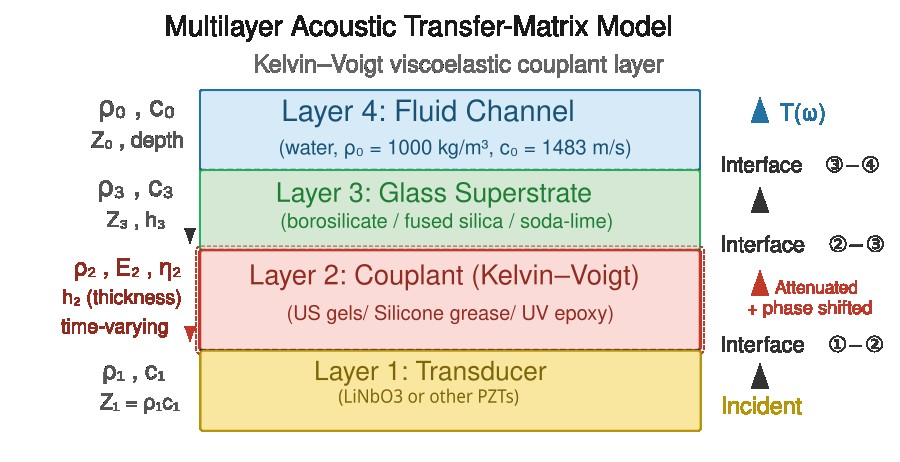

<pre> 
Title: BENG207_Multilayer_model
Author: BENG207 students (Instructor: Akihiro J. Matsuoka, M.D., D.M.Sc., Ph.D., FACS, Co-instructor: James Friend, Ph.D.)
Course: BENG207 Winter/Spring Semester (2026)
Status: Draft
Type: Analytical model
License: Public domain
Further discussion: TBD
</pre>

Instruction to BENG207 students: Please review all of the variables/parameters.

---

## Table of Contents

* [Abstract](#abstract)
* [Background and Significance](#background-and-significance)
* [Deliverable](#deliverable)
* [BENG207 Multilayer Model](#beng207-multilayer-model-analytical-model)
* [Parameters](#parameters)
* [Output Figures: Captions](#output-figures-captions)

---

## Abstract

TBW

## Background and Significance

Our most recent iteration of the biohybrid cochlear implant, designed by A.J.M., resulted in fabrication of multiple prototype devices for feasibility testing. These experiments revealed a critical limitation in our prior approach to generating a static brain-derived neurotrophic factor (BDNF) concentration gradient. Although the initial gradient was sufficient to support neurite extension from human iPSC-derived otic neuronal progenitors and promote connectivity toward endogenous spiral ganglion neurons, the gradient was not temporally stable. By approximately day 7 in culture, the BDNF distribution became uniform within the microchannel, indicating dissipation of the intended concentration profile (Nella et al., 2024).

The initial studies were conducted using a commercially available microfluidic platform (Zona), which was not designed to replicate the structural or biochemical microenvironment of the inner ear. Nevertheless, these experiments established proof-of-concept feasibility and provided a quantitative foundation for further device optimization.

Building upon these findings, we then initiated a second-generation design effort in collaboration with the BENG207 (2025) student cohort between January and May 2025. The revised microfluidic architecture was engineered to better approximate key aspects of the inner ear environment, including spatial confinement, gradient stability, and controlled mass transport dynamics. This redesign aims to support sustained neurotrophic signaling and improved structural integration in subsequent biohybrid implant prototypes. The initial results are encouraging and Keristen Russ is now finalizing the experiments for the publication.

The rationale of the third generation of our microfluidic device was designed by AJM and James Friend, Ph.D. (previously at UCSD, now the chair of Washington University in St. Louis) in Fall 2025 in that we now incorporate surface acoustic wave technology to generate long-lasting BDNF concentration gradient. Based on Jia et al., 2025, the transfer-matrix (or transmission-line) method for multilayer acoustics is well-established. It seems that swapping in a complex wave speed from the Kelvin-Voigt model is straightforward. Frequency-dependent attenuation α(ω) ∝ ω²η/(2ρc³) at leading order, which means their 50 MHz system will be far more sensitive to couplant viscoelasticity than lower-frequency devices — that is, I think, a testable condition. According to Alexi, we are using a much lower frequency (somewhere around 1 MHz (800 kHz), please ask him). I can think of three failure modes I can list (increased attenuation, phase drift, impedance mismatch change) are genuinely distinct and could in principle be disentangled experimentally by tracking node positions vs. overall force amplitude over time.

Jia et al. clearly stated in the manuscript that fluid couplants (e.g., US gels) degrade via evaporation and that this motivates UV-epoxy solid bonding (Section I in Jia et al., 2025; citing references [40, 47, and 48]). As such, our model could provide the quantitative framework — how much thickness change or modulus drift is tolerable before the resonance condition in the Si substrate (which they showed is critical via the BAW resonance analysis) falls apart. The fact that their system relies on a narrow-band interplay between SAW cavity resonances and BAW modes in the silicon (Fig. 5 in the manuscript) means even small phase shifts in the couplant could detune the system significantly.

The major difference between this paper and our experimental setup is the thickness of the couplant layer. In Jia et al.'s device it is < 1 µm (UV-cured photo-curable resin), so for solid-bonded systems the effect may be small. Therefore, this BENG207 multilayer model is most relevant for gel/water/grease-coupled configurations where the layer is thicker (tens of µm, which I think is the case based on conversation with Alexi).

As one can easily conceptualize, a single KV element gives attenuation scaling as ω², which may not capture all couplant behaviors. If the gel dehydrates (I don't even know how fast though), we are really dealing with a time-varying thickness and a transition from viscous liquid toward a stiffer solid — a more complete model might need E(t), η(t), and h(t) all evolving. Therefore, we start with quasi-static parameter sweeps through the transfer matrix and show sensitivity maps. Experimentally validating the model would require either measuring the couplant properties independently (e.g., with a separate ultrasonic characterization setup) or inferring them from the pattern decay dynamics, which introduces another reverse engineering challenge, so to speak.

## Deliverable

Here we compute the transmission coefficient T(ω) through the stack (LiNbO₃ – couplant (US gels) – cover-glass – water) as a function of couplant thickness, E, and η. Then we show how the resonance peaks in T(ω) shift and broaden as you vary these parameters over physically realistic ranges for gel dehydration. Overlay that with the experimental acoustophoresis spectrum shape from Fig. 3(c) or Fig. 5 to show which parameter changes are most consistent with observed degradation (Jia et al., 2025).

## BENG207 Multilayer Model (Analytical Model)

### Transducer (source side: bottom layer)

The paper uses LiNbO₃ at ~50 MHz and we are also using LiNbO₃, although Alexi indicated that we may have to use other piezoelectric materials (I do not know much about this but Alexi knows). For the transfer matrix we just need the acoustic impedance on the source side. At this point I'll use Z₁ ≈ 34 MRayl (LiNbO₃ longitudinal). Please confirm this with Alexi because we may have to use a different acoustic impedance (MRayl).

### Couplant layer (US gel layer)

This is the layer we're modeling as Kelvin–Voigt. We need more accurate information.

* What exact couplant? — Ultrasound gel, water, silicone grease, UV epoxy?
* Approximate thickness? For gel/water coupling this is typically 5–50 µm; for epoxy maybe 1–5 µm
* If you don't know, I'll set up a sweep over thickness h₂ = 1–50 µm

### Figure

If you want to modify this figure, a vector version can be found in docs/img.

Figure 1: The four-layer stack reads bottom to top: transducer → couplant (the Kelvin–Voigt layer in red, the one we're modeling) → glass superstrate → fluid channel. The key parameters for each layer are labeled on the left, wave propagation and reflections on the sides, and the transfer-matrix equations at the bottom.

The red "degradation" badge highlights that E₂, η₂, and h₂ are the time-varying quantities we'll sweep to predict pattern decay.

## Parameters

The parameters that I initially set are as follows:

* LiNbO₃ (longitudinal 6570 m/s)
* US gel couplant (ρ = 1020 kg/m³, E = 5 kPa, and η = 2 Pa·s)
* Cover-slip: 150 µm
* Water channel: 100 µm
* 20 MHz — way too high

## Output Figures: Captions

* **Fig 1** — Transmission spectrum |T(f)| from 15–25 MHz for four couplant thicknesses (5, 15, 30, 50 µm), fresh vs. degraded US gel

* **Fig 2a/2b** — Sensitivity maps |T| vs. (h₂, η₂) at fixed E₂, and |T| vs. (h₂, E₂) at fixed η₂ — two heatmaps showing which couplant parameter matters more or less

* **Fig 3** — Phase shift during degradation — tracks how US gel aging (stiffening + thinning) shifts the transmission phase and displaces the standing wave nodes

* **Fig 4** — Degradation evolution — six time snapshots of the spectrum (17–23 MHz; this frequency range is too high, sorry) as gel degrades from fresh to old

* **Fig 5** — Couplant attenuation — frequency-dependent attenuation (dB/mm) and phase velocity in the US gel for four viscosity values (0.5, 2, 10, 50 Pa·s)

* **Fig 6** — Broadband sweep |T(f)| from 1–100 MHz for five transducer thicknesses (330, 165, 110, 82, 66 µm), each targeting a different center frequency (10, 20, 30, 40, 50 MHz) — shows how changing h₄ opens up different frequency bands

* **Fig 7** — Optimal couplant thickness vs. frequency — for each frequency from 1–80 MHz, sweeps h₂ and finds the thickness that maximizes |T|, also reports |T| at four fixed thicknesses (1, 5, 20, 50 µm) for comparison

* **Fig 8** — Glass resonance interaction map — 2D heatmap of |T(f, h₃)| showing how glass thickness (0.1–3 mm) creates periodic transmission windows at its resonance harmonics f_n = n·c₃/(2h₃)

* **Fig 9** — Multi-parameter design optimization — brute-force (i.e., primitive) grid search over (h₂, h₃, h₄) simultaneously for eight target frequencies, reports optimal geometry and maximum |T| for each
